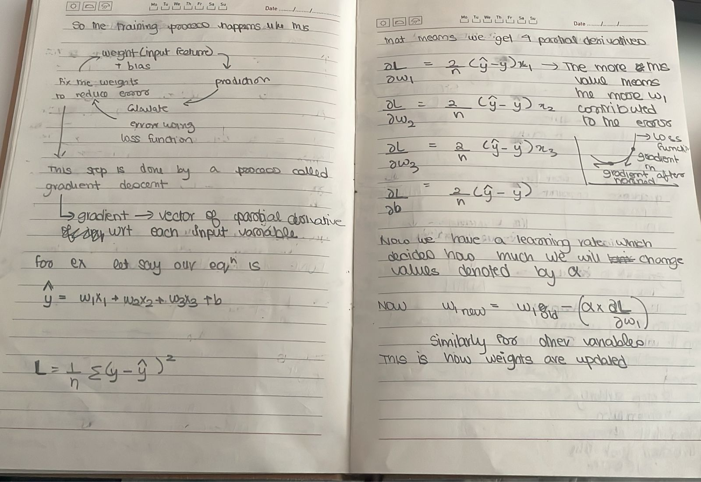
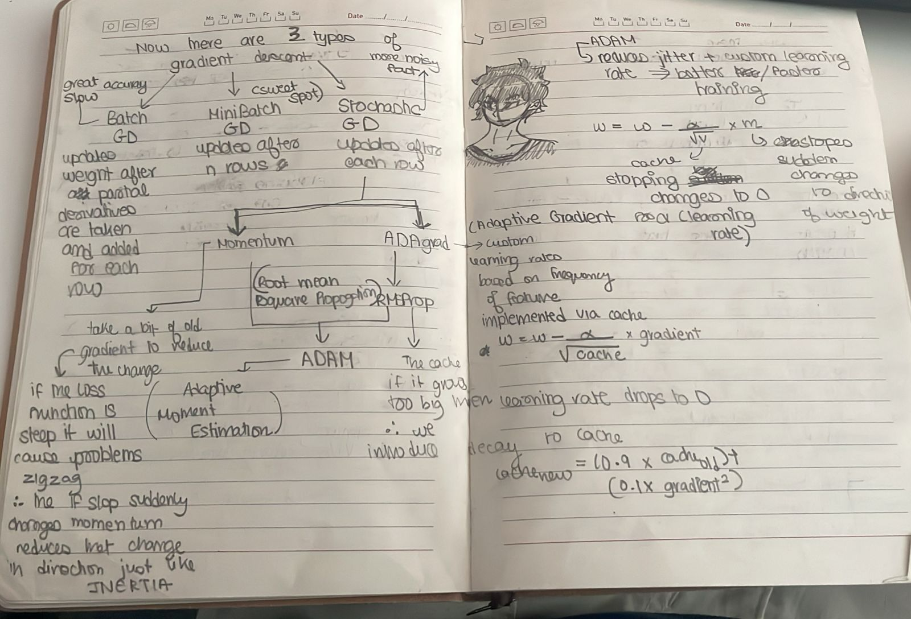
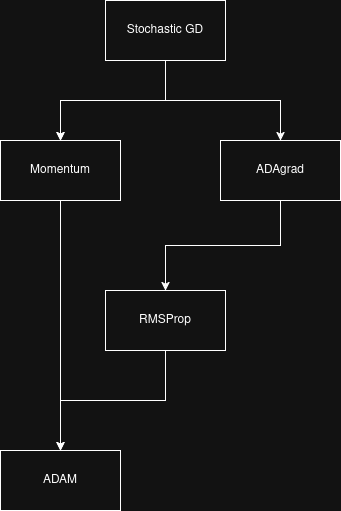

Date: 2026-05-14
Topics: #gradient_descent #optimisation #derivatives #ai #ml 
Link: 
Class: [[]]

---
As mentioned before any given model has 3 components 
1. Algorithm
2. [Loss functions](Loss_Functions/Loss%20functions.md)
3. Optimisation routine

The most well known optimisation routine is called **Gradient Descent**

**Gradient**: Its a vector of partial derivatives wrt to each input variable, we get 1 value of cost function however each feature contributes differently to the loss therefore to improve each feature we need to isolate its contribution from the cost.

So gradient descent would mean bringing the gradient down. How that happens is we have a loss function, to reduce the loss we need to fix the weights and biases in such a way that the final output of the loss is minimum. To do that we calculate the gradient of each feature, and reduce accordingly.

Now there are multiple types of Gradient Descent we can do based on the requirements.
The types are:
1. Batch GD: update weights after partial derivatives are taken and added for each row (complete dataset). (Very accurate and very slow)
2. Mini Batch GD: updates weights after n rows. (Balanced)
3. Stochastic GD: updates weights after each row. (Least Accurate (noise) and very fast)
	1. Momentum
	2. ADAgrad
		1. RMSProp
			1. ADAM

### Small definitions

- **Mini Batch GD**: Uses a small group of training examples at a time, so it is faster than Batch GD but steadier than pure Stochastic GD.

- **Momentum**: Keeps some of the previous update, so the model moves more smoothly and does not zig-zag too much.

- **AdaGrad**: Changes the learning rate for each weight based on how often that weight gets updated. Useful when some features appear more than others implemented via a cache.

- **RMSProp**: Fixes one problem of AdaGrad by stopping the learning rate from becoming too small by adding a decay rate to the cache.

- **Adam**: Combines Momentum and RMSProp, so it is usually fast, stable, and easy to use.

Flowchart to demonstrate improvements of each gradient descent algorithm
