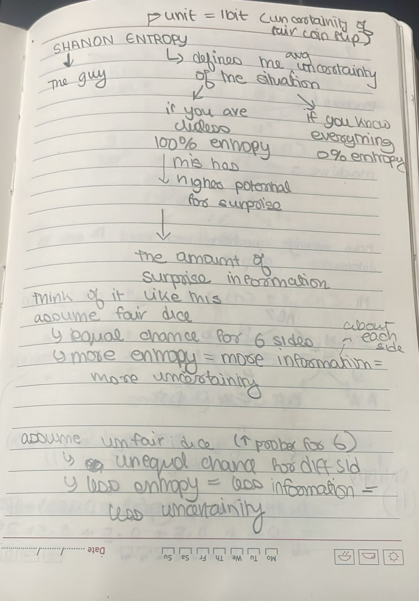
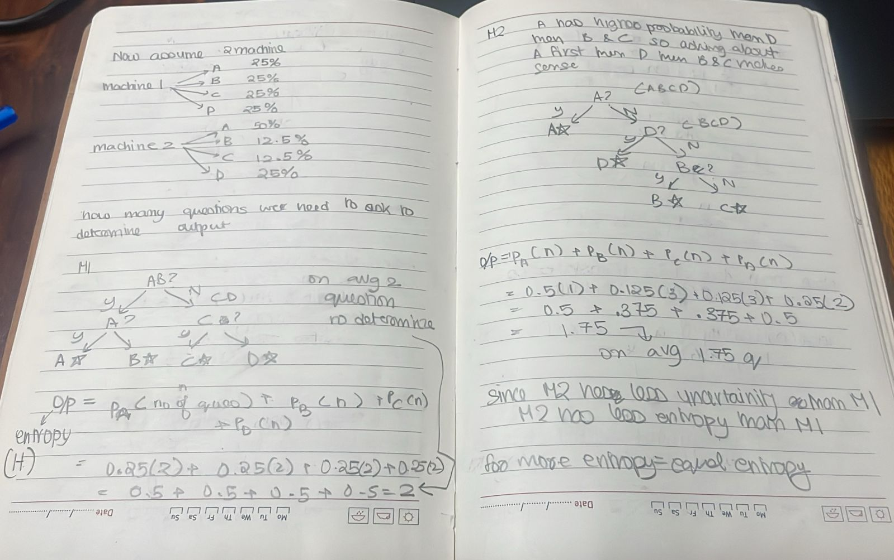
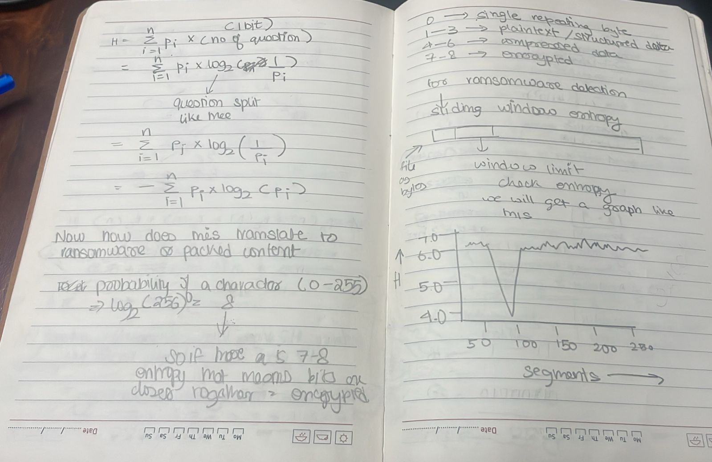

Date: 2026-05-14
Topics: #loss_function #entropy #decision_tree
Link: 
Class: [[]]

---

# Entropy

Entropy is a measure of uncertainty or disorder in a group of samples.

## Simple idea

- Low entropy means the group is more pure
- High entropy means the group is more mixed
- Decision trees use it to choose better splits

## Derivation

## Used by

- [Decision Trees + Random Forest](../Algorithms/Decision%20Trees%20+%20Random%20Forest.md)
- [[Random Forest]]