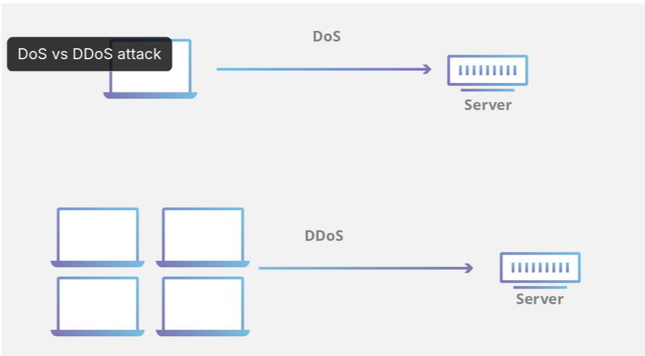

Date: 2026-01-05
Topics: #dos #cybersecurity #threat
Link: 
Class: [[]]

---

Denial of service is used to attack the A of the CIA triad
During a dos attack it floods the server with false request overwhelming the server in order to disrupt the operations

Difference between DOS & DDOS (Distributed Denial of Service)
**DOS** attacks originate from **one system** whereas **DDOS** attacks originate from **multiple systems.** DDOS attacks are faster and harder to block than DOS attacks, because multiple systems are to be blocked to stop the attack

## Types of DOS Attacks
1. Buffer Overflow
2. Flood Attacks

### Buffer Overflow
The attacker sends a packet that doesn't conform to the rules set by the programmer and if there are not proper check set in place then the buffer overflows due to the extra data sent, this causes a segmentation fault or some other error to halt the operations of the service or program.

Example
**Ping of Death**. In the 90s, sending a ping packet larger than the maximum IP size (65,535 bytes) would instantly crash many Windows and Linux systems because they didn't know how to handle the extra data.

### Flood Attacks
The attacker sends a large volume of packets to the server, in an attempt to overwhelm the server and therefore stopping the operations 

Example
**SYN Flood**. The attacker sends thousands of "Hello" (SYN) packets to start a connection but never responds to the server's reply. The server waits for a response that never comes, holding the line open until it can accept no new connections.

**DNS Flood**

| Feature | Buffer Overflow                                                                                                           | Flow Attacks                                                                                      |
| ------- | ------------------------------------------------------------------------------------------------------------------------- | ------------------------------------------------------------------------------------------------- |
| Core    | Exploits a **software vulnerability**. It inputs more data than a program's "buffer" (temporary memory storage) can hold. | Exploits **resource limits**. It consumes bandwidth, CPU, or memory by sending too many requests. |
| Volume  | **Low Volume.** The attacker might only need to send a few kilobytes of data.                                             | **High Volume.** The attacker needs to generate massive traffic (often Gigabits/sec).             |
| Target  | The **Application Logic** or OS Kernel. It corrupts the memory stack or heap.                                             | The **Infrastructure**. It clogs network pipes or fills connection state tables.                  |

