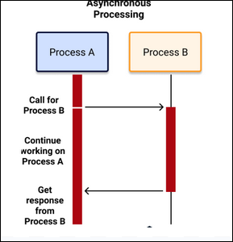
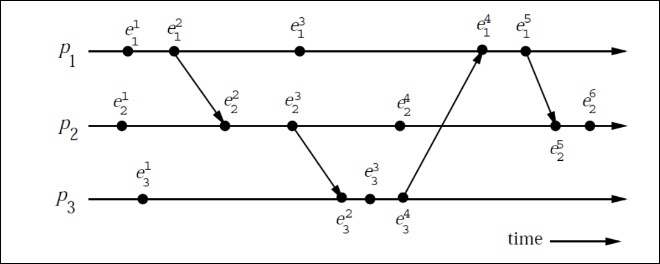

Date: 2026-03-24
Topics: #distributed_systems #exam_answers #college
Link:
Class: [[]]

---

# Distributed Computing Series Answers

This file contains model answers for distributed computing exam questions.

## Key topics covered

- [[GFS_AFS]] - File systems
- Distributed system architectures
- Consensus algorithms
- Network protocols
- Fault tolerance

## Note

Detailed answers for all exam series questions. See individual topic notes for detailed explanations.

## Related files

- [[BT Question Bank]] - Question bank
- [[Solutions to question bank]] - Solutions
- [[GFS_AFS]] - Detailed file system notes

---

**PART – A (Answer all questions – 3 marks each)**

**1. Discuss about the transparency requirements of distributed system**  
Transparency hides the distribution and heterogeneity from users and programmers so that the system appears as a single coherent computer.

The key transparency requirements (as per design issues in Module 1) are:

- **Access transparency**: Differences in data representation and access operations are hidden; the same operations work for both local and remote resources.
- **Location transparency**: Users need not know the physical location of resources; resources are accessed by name only.
- **Migration transparency**: Resources can be moved without affecting ongoing operations or names.
- **Relocation transparency**: Resources can be relocated even while they are being accessed.
- **Replication transparency**: Users are unaware of multiple copies of resources.
- **Concurrency transparency**: Concurrent access to shared resources is masked; users see consistent results.
- **Failure transparency**: The system continues to operate correctly despite failures (fault tolerance).

These requirements simplify programming and improve usability in distributed environments.

**2. Explain any three characteristics of a distributed system**  
(From Module 1 – Features of Distributed Systems)

1. **No common physical clock**: There is no globally shared clock; processes must use logical clocks or message passing to order events.
2. **No shared memory**: Processes do not share a common memory space; they communicate solely by passing messages over a network.
3. **Geographical separation & heterogeneity**: Processes run on autonomous computers that may be geographically dispersed, run different operating systems, and have different speeds. They cooperate to solve a common problem.

These characteristics make coordination and consistency challenging but enable scalability and fault tolerance.

**3. Describe past and future cones of an event with a diagram**  
(From Module 1 – Cuts of a Distributed Computation)

The **past cone** of an event _e_ consists of all events that causally precede _e_ (i.e., events that happened-before _e_).  
The **future cone** of _e_ consists of all events that are causally affected by _e_ (i.e., events for which _e_ happened-before them).

**Diagram description** (as shown in notes):

- A vertical line for each process with events marked as dots.
- Arrows represent message sends/receives (causal links).
- For event _e_ at process _P_i_, the past cone fans upwards from earlier events across processes; the future cone fans downwards from _e_ to later events.

This cone structure visually captures the causal precedence relation (→) and is used for reasoning about consistent cuts and global states.

**4. With a diagram, explain how non-blocking send primitive works**  
(From Module 1 – Primitives for distributed communication)

A **non-blocking send** primitive returns control to the invoking process immediately after the message is copied out of the user buffer (buffered option) or handed to the kernel, even if the message has not yet been delivered.

**Diagram description** (as in notes):

- Process _P_i_ calls `send(dest, buffer)`.
- The call returns instantly (control flows back to next instruction).
- A dashed arrow shows the message being transmitted asynchronously in the background.

Advantage: The sender can continue computation without waiting for the receiver. Disadvantage: The sender must handle buffering and possible later errors.

**5. Interpret a consistent global state in terms of cuts**  
(From Module 2 – Global state and snapshot recording algorithms)

A **consistent global state** is a collection of local process states and channel states that could have occurred in a failure-free execution.

**In terms of cuts**:

- A cut is a line that divides the space-time diagram into PAST and FUTURE.
- A **consistent cut** satisfies: “Every message received in the PAST must have been sent in the PAST.”
- No message can cross the cut from FUTURE to PAST (no orphan messages).
- Messages crossing from PAST to FUTURE are recorded in the corresponding channel state.

**Diagram description** (Figure in notes):

- Consistent cut (C1): All receive events in PAST have matching send events in PAST.
- Inconsistent cut (C2): A receive event in PAST has its send event in FUTURE → impossible state.

A consistent global state corresponds to a consistent cut and is essential for checkpointing, snapshot recording, and termination detection.

\*\*PART – B

### 6(a) Discuss any four applications of distributed computing (8 marks)

**Applications of Distributed Computing (from Module 1)**

1. **Mobile Systems**  
   Mobile systems use wireless communication based on electromagnetic waves over a shared broadcast medium. They support two architectures:
   - Base-station (cellular) approach – each cell is served by a static powerful base station.
   - Ad-hoc network approach – no base station; all responsibility for routing and communication is distributed among mobile nodes themselves.  
     Key issues include routing, location management, channel allocation, and position estimation.

2. **Sensor Networks**  
   A sensor is a processor with an electro-mechanical interface that senses physical parameters such as temperature, velocity, pressure, humidity, or chemicals. Sensors may be mobile or static and usually communicate wirelessly. They are used for real-time monitoring and control applications.

3. **Peer-to-Peer (P2P) Computing**  
   In P2P computing, all interactions occur at a “peer” level without any hierarchy. It is a shift from traditional client-server architecture. P2P networks are self-organizing and allow direct resource sharing (e.g., file sharing) among equal nodes.

4. **Grid Computing**  
   Grid computing connects a large number of heterogeneous machines (often via Ethernet or the Internet) to form a virtual supercomputer. It utilizes idle CPU cycles of machines across the network for large-scale computations. It is a subset of distributed computing that provides high aggregate computing power.

These applications exploit the inherent advantages of distribution such as resource sharing, scalability, and fault tolerance.

**Different Models of Communication Networks**  
**(From Module 1 – Models of Communication Networks)**

In distributed systems, processes communicate **solely by message passing** over a communication network. The behaviour of the underlying network significantly affects the design of distributed algorithms. The notes describe the following important **models of communication networks**:

### 1. **Synchronous vs Asynchronous Communication Networks**

- **Synchronous Communication Network**:
  - There is a known upper bound on message transmission delay.
  - Messages are delivered within a fixed, known time limit.
  - Processes can execute in “rounds” or “steps”.
  - Easier to design algorithms because timeouts can be used reliably.
  - Example: If a message is not received within the bound, the sender knows it was lost or the receiver failed.
  - Used in many consensus and agreement algorithms (e.g., consensus in synchronous systems with crash failures).

- **Asynchronous Communication Network** (Most common model in practice):
  - No upper bound on message transmission delay.
  - Messages can take arbitrarily long time to reach the destination.
  - Message delays are finite but unpredictable.
  - A process cannot distinguish between a slow message, a lost message, or a failed receiver.
  - Makes algorithm design much harder (e.g., impossibility of consensus in fully asynchronous systems with even one crash failure – FLP result).
  - Most real-world distributed systems (Internet, LANs) follow this model.

### 2. **Reliable vs Unreliable Communication Channels**

- **Reliable Channels**:
  - Messages are never lost, duplicated, or corrupted.
  - Every message sent is eventually delivered exactly once (in some models, FIFO order is also guaranteed).
  - Simplifies algorithm design.

- **Unreliable (Lossy) Channels**:
  - Messages may be lost, duplicated, garbled, or delivered out of order.
  - Algorithms must include mechanisms for retransmission, acknowledgments, sequence numbers, etc.
  - More realistic but increases complexity.

### 3. **FIFO (First-In-First-Out) vs Non-FIFO Channels**

- **FIFO Channels**:
  - Messages sent from process Pi to Pj are delivered in the same order in which they were sent.
  - Very useful for many snapshot and checkpointing algorithms (e.g., Chandy-Lamport snapshot algorithm assumes FIFO channels).
  - Simplifies ordering of messages.

- **Non-FIFO Channels**:
  - Messages can be delivered in any order (reordering is possible).
  - More general and realistic model.
  - Algorithms must handle out-of-order delivery using timestamps or sequence numbers.

### 4. **Point-to-Point vs Broadcast/Multicast Networks**

- **Point-to-Point**:
  - A message is sent from one specific sender to one specific receiver.
  - Most common in distributed algorithms.

- **Broadcast / Multicast**:
  - A message can be sent to all processes or to a group of processes simultaneously.
  - Used in leader election (e.g., Suzuki-Kasami uses broadcast), group communication, etc.

### Summary Table (for quick revision)

| Model Aspect                   | Synchronous            | Asynchronous (Common)              |
| ------------------------------ | ---------------------- | ---------------------------------- |
| Message Delay                  | Bounded                | Unbounded                          |
| Difficulty of Algorithm Design | Easier                 | Harder                             |
| Use in Consensus               | Possible with failures | Impossible with even 1 crash (FLP) |
| FIFO / Non-FIFO                | Can be either          | Usually Non-FIFO in practice       |
| Reliability                    | Often assumed reliable | May be lossy                       |

**Key Point from Notes**:

> “The communication network provides the facility of information exchange among processors. The processors do not share a common global memory and communicate solely by passing messages over the communication network.”

These models directly influence the correctness and performance of algorithms for **mutual exclusion, leader election, global snapshot, termination detection, consensus**, etc.

### Part A: Explain any five algorithmic challenges in distributed computing (10 Marks)

Distributed computing poses several unique algorithmic challenges because of the absence of shared memory, lack of a global clock, unpredictable message delays, and concurrent execution of processes. Some of the major algorithmic challenges are as follows:

#### Designing useful execution models and frameworks

One of the fundamental challenges is to develop suitable models to represent the execution of distributed programs. The interleaving model and the partial-order model are two widely adopted models. These models help in operational reasoning about distributed computations and serve as the foundation for designing correct and efficient distributed algorithms. Without proper execution models, it becomes extremely difficult to reason about the correctness of algorithms.

#### Dynamic distributed graph algorithms and distributed routing algorithms

A distributed system can be naturally modelled as a graph where processes are nodes and communication links are edges. However, in real systems, this graph is dynamic — link loads change, nodes may fail or recover, and network topology may vary. Designing distributed graph algorithms (such as routing, spanning tree construction, etc.) that can efficiently adapt to these dynamic changes is a major algorithmic challenge.

#### Time and global state in a distributed system

There is no global physical clock in a distributed system, and physical clocks cannot be perfectly synchronized. Therefore, providing a meaningful notion of time and capturing the global state of the system (which consists of local states of all processes and states of communication channels) is extremely difficult. This challenge is central to many problems such as checkpointing, debugging, and consistent snapshot recording. Logical time concepts are used to overcome the absence of physical global time.

#### Synchronization / coordination mechanisms

Processes in a distributed system have only a limited local view of the system state. Yet, many problems require coordination among processes. Classical problems such as mutual exclusion, leader election, deadlock detection, termination detection, and garbage collection all require proper synchronization. Designing efficient coordination mechanisms despite asynchronous communication and no shared memory is a significant algorithmic challenge.

#### Group communication, multicast, and ordered message delivery

In many distributed applications, processes form groups and need to communicate with multiple processes simultaneously (multicast). When several processes send messages concurrently, different receivers may receive these messages in different orders, which can violate the intended semantics of the application. Therefore, it is necessary to define and implement formal semantics for ordered message delivery such as causal order and total order. Designing efficient and scalable group communication protocols that guarantee desired ordering is an important challenge.

These five challenges highlight why algorithm design in distributed systems is significantly more complex than in centralized systems.

### Q6 b) **Causal Precedence Relation with Space-Time Diagram (Module 1 & 2)**

The **causal precedence relation** (denoted → or “happened-before”) is fundamental in distributed systems.

**Definition**:  
Event _a_ causally precedes event _b_ (a → b) if:

- _a_ and _b_ are in the same process and _a_ occurred before _b_, or
- _a_ is the send event of a message and _b_ is the corresponding receive event, or
- There exists an event _c_ such that a → c and c → b (transitivity).

**Space-Time Diagram Explanation** (Refer to diagram in Module 1 notes):

- Vertical lines represent processes (P1, P2, …).
- Dots on the lines represent events.
- Horizontal or slanted arrows represent messages (send → receive).
- If there is a path from event _e1_ to event _e2_ following the arrows and moving downward along process lines, then _e1_ → _e2_.
- Events with no path between them are concurrent (incomparable under →).

This relation captures the partial order of events and is used for logical clocks, consistent global snapshots, and debugging.

### 7a)**Compare Scalar Time and Vector Time based on consistency and event counting. (Module 2)**

### Introduction

In distributed systems, there is no global physical clock. To capture the causal ordering of events, Lamport introduced **Scalar Time** (also called Lamport Logical Clock) in 1978. Later, **Vector Time** (independently proposed by Fidge, Mattern, and Schmuck) was developed to overcome the limitations of scalar time. Both are systems of logical clocks, but they differ significantly in their ability to represent causality.

### Comparison Table (Scalar Time vs Vector Time)

| Property                        | Scalar Time (Lamport’s Logical Clock)                                                                         | Vector Time (Fidge-Mattern-Schmuck)                                                                                                                           |
| ------------------------------- | ------------------------------------------------------------------------------------------------------------- | ------------------------------------------------------------------------------------------------------------------------------------------------------------- |
| **Basic Structure**             | A single integer value maintained by each process (Ci)                                                        | An n-dimensional vector of integers [C1, C2, ..., Cn] where n = number of processes                                                                           |
| **Consistency**                 | **Weak consistency** only C(e) < C(f) ⇒ e → f (If e happened before f, then timestamp of e is smaller)  | **Strong consistency** C(e) < C(f) ⇔ e → f (Exact equivalence between timestamp comparison and causality)                                               |
| **Event Counting**              | Counts only **local events** of that process. Clock is incremented by 1 for every event.                      | Counts **causal events** across the entire system. Each component Ci[j] represents the number of events at process Pj that causally affect the current event. |
| **Total Ordering**              | Can impose a **total order** on all events by using a tie-breaker (process ID). Timestamp = (t, i)            | Provides only **partial order**. To get total order, extra mechanisms are required.                                                                           |
| **Strong Consistency**          | **Not satisfied**. Two concurrent (non-causal) events at different processes can have the **same timestamp**. | **Fully satisfied**. Two events have same vector timestamp if and only if they are concurrent.                                                                |
| **Ability to detect causality** | Cannot accurately detect whether two events are concurrent or causally related.                               | Can **exactly** detect causal relationship, concurrency, and incomparable events.                                                                             |
| **Overhead**                    | Low (only one integer per process)                                                                            | Higher (n integers per process)                                                                                                                               |
| **Applications**                | Simple applications where approximate ordering is sufficient (e.g., basic mutual exclusion).                  | Advanced applications requiring precise causality (distributed debugging, causal DSM, checkpointing, etc.)                                                    |

### Detailed Explanation of Key Properties

#### 1. **Consistency**

- **Scalar Time (Weak Consistency)**:  
  It guarantees only one direction — if event _e_ causally precedes event _f_, then the scalar timestamp of _e_ is less than that of _f_. However, the reverse is **not** true. Two events with C(e) < C(f) may still be concurrent (not causally related).  
  → This is the main drawback of scalar clocks.

- **Vector Time (Strong Consistency)**:  
  It satisfies **if and only if** relation.
  - C(e) < C(f) ⇔ e → f (e happened before f)
  - C(e) = C(f) ⇔ e and f are concurrent
  - C(e) and C(f) are incomparable ⇔ neither e → f nor f → e  
    This makes vector time much more powerful for reasoning about distributed computations.

#### 2. **Event Counting**

- **Scalar Time**:  
  Each process simply increments its local clock by 1 for every event (internal, send, or receive). It only counts **how many events** occurred locally, not which events from other processes influenced it.

- **Vector Time**:  
  Each process maintains a vector of size _n_.
  - When process Pi executes an event, it increments its own component Vi[i].
  - When it sends a message, it piggybacks its entire vector.
  - On receiving a message, the receiver takes component-wise maximum and then increments its own component.  
    Thus, every entry in the vector counts the number of events from that process that causally affect the current state.

#### 3. **Total Order vs Partial Order**

- Scalar time can easily create a **total order** on all events by combining the timestamp with process ID (lower process ID gets higher priority in case of tie).
- Vector time naturally gives only a **partial order** (causal order). Converting it to total order requires additional rules.

### Conclusion

Scalar time is **simple and lightweight** but suffers from **weak consistency** and cannot distinguish concurrent events accurately. It is sufficient only when approximate ordering is enough.

Vector time is **more expressive and accurate** because it provides **strong consistency** and exactly captures the causal dependencies across the entire distributed system. However, it incurs higher message and storage overhead (O(n) size).

**Hence, the choice between scalar and vector time depends on the application requirement**: use scalar time for simplicity, and vector time when precise causality detection is critical (e.g., distributed debugging, causal memory, consistent checkpointing, etc.).

### 1. Ring Algorithm for Leader Election (6–8 marks)

**Introduction**  
The ring algorithm is a **token-based** leader election algorithm that works on a **logical ring** topology. Every process knows only its clockwise neighbour. The goal is to elect the process with the **highest identifier** as the coordinator (leader). It is simple, works in a fully connected ring, and guarantees safety and liveness.

**Message Types**

- **Election message** – carries a process ID (used to find the highest ID).
- **Elected message** – announces the winner.

**Algorithm Steps (Detailed)**

1. **Initiation**  
   Any process can start the election. It marks itself as **participant**, places its own ID in an **election** message, and sends it to its clockwise neighbour.

2. **Receiving an Election Message**  
   When a process receives an election message:
   - If the received ID > its own ID → forward the message unchanged.
   - If the received ID < its own ID **and** the process is **not yet a participant** → replace the ID with its own ID and forward the message.
   - If the received ID < its own ID **but** the process is **already a participant** → do **not** forward (discard).
   - In **all** forwarding cases, the process marks itself as **participant**.

3. **Election Completion**  
   When a process receives an election message containing **its own ID**, it realises it has the **highest ID** in the ring.
   - It becomes the **coordinator**.
   - It marks itself as **non-participant**.
   - It sends an **elected** message (containing its own ID) to its clockwise neighbour.

4. **Propagation of Elected Message**  
   Every process that receives the **elected** message:
   - Marks itself as **non-participant**.
   - Sets its local variable `elected_i` to the coordinator’s ID.
   - Forwards the elected message to its clockwise neighbour.  
     The message circulates the entire ring until it returns to the coordinator.

**Key Properties**

- **Safety**: Only the process with the highest ID becomes coordinator.
- **Liveness**: Election always terminates; every process eventually knows the coordinator.
- **Message Complexity**:
  - Worst case: **2N** messages (N election + N elected).
  - Best case: **N** messages (if highest ID process starts).

**Worked Example (from notes)**  
Processes in ring order: **P20 → P5 → P10 → P18 → P3 → P16 → P9** (back to P20).  
Suppose **P10** initiates election.

- P10 sends election(10) → P18
- P18 (18 > 10) forwards election(10) → P3
- P3 (3 < 10) replaces with 3 → sends election(3) → P16
- P16 (16 > 3) forwards election(3) → P9
- P9 (9 > 3) forwards election(3) → P20
- P20 (20 > 3) forwards election(3) → P5
- P5 (5 > 3) forwards election(3) → P10
- P10 receives its **own** ID (3) back? Wait – actually the highest ID (P20) will eventually receive its own ID and become coordinator.

**Diagram Description (as in notes)**:  
Vertical/horizontal ring with arrows showing election message travelling clockwise. When the highest ID process receives its own ID back, it sends the elected message in the same direction.

**Advantages**: Simple implementation, no central coordinator needed to start election.  
**Disadvantages**: Requires a logical ring; failure of one process breaks the ring unless repaired.

---

### 2. Bully Algorithm for Leader Election (6–8 marks)

**Introduction**  
The Bully algorithm is a **non-token-based** leader election algorithm. The process with the **highest identifier** always becomes the coordinator (hence the name “Bully”). It works on a fully connected network (any process can send directly to any other).

**Message Types**

- **Election** message – announces an election.
- **Answer (OK)** message – reply to election.
- **Coordinator** message – announces the winner.

**Algorithm Steps (Detailed)**

1. **Initiation**  
   Any process Pi that notices the current coordinator has failed (or wants to start election) sends an **Election** message to **all processes with higher IDs** than itself.

2. **Response from Higher-ID Processes**
   - If a higher-ID process receives an Election message, it immediately sends back an **Answer (OK)** message to the sender.
   - The higher-ID process then **starts its own election** (unless it has already done so).

3. **Waiting for Answers**  
   The initiator waits for time **T**.
   - If **no Answer** is received within T → Pi considers itself the **highest alive process** and becomes coordinator.
   - It sends a **Coordinator** message to **all processes with lower IDs**.

4. **Receiving Coordinator Message**  
   Any process that receives a Coordinator message:
   - Sets its local variable `elected_i` to the new coordinator’s ID.
   - Treats that process as the new leader.

5. **If a Higher Process Comes Back**  
   A previously crashed higher-ID process, when it recovers, immediately starts an election. Because it has the highest ID, it will bully everyone and become the new coordinator.

**Key Properties**

- **Safety**: Only the highest-ID alive process becomes coordinator.
- **Liveness**: Election always terminates.
- **Message Complexity**:
  - Worst case: **O(N²)** messages (every process may send Election to all higher processes).
  - Best case: When highest-ID process starts, only **N–1** Coordinator messages.

**Worked Example (from notes)**  
Process IDs: 0, 1, 2, 3, 4, 5, 6, 7.  
Initial coordinator **P7** crashes. **P4** initiates election.

- P4 sends **Election** to P5, P6, P7 (but P7 is down).
- P5 and P6 send **Answer (OK)** to P4 and start their own election.
- P6 sends Election to P7 (no reply).
- P6 waits timeout → becomes coordinator → sends **Coordinator** to P0–P5.
- All processes set `elected_i = 6`.

**Diagram Description (as in notes)**:  
Space-time diagram showing:

- Stage 1: Election messages going up to higher processes.
- Stage 2: Answer messages coming back.
- Stage 3: Timeout at highest alive process.
- Stage 4: Coordinator messages broadcast downward.

**Advantages**:

- No need for ring structure.
- Works in fully connected network.
- Fast when highest-ID process is alive.

**Disadvantages**:

- High message overhead (O(N²) in worst case).
- Many processes may start simultaneous elections.

### 7(b) Explain any four applications of vector time (8 marks)

**Applications of Vector Time (Module 2 – Vector Time)**

Vector clocks are strongly consistent and exactly track causal dependencies. Important applications include:

1. **Distributed Debugging**  
   Vector timestamps help detect whether one event causally affected another during program execution.

2. **Implementations of Causal Ordering Communication**  
   Messages are delivered only after all causally preceding messages have been delivered, ensuring causal consistency.

3. **Causal Distributed Shared Memory**  
   Used to maintain consistency in Distributed Shared Memory (DSM) systems by tracking causal dependencies between reads and writes.

4. **Establishment of Global Breakpoints and Determining Consistency of Checkpoints in Optimistic Recovery**  
   Vector time helps identify consistent global states and suitable recovery points without domino effect.

Because vector time satisfies strong consistency (C(e) < C(f) ⇔ e → f), it is more powerful than scalar time for these applications.

### 8(a) Explain in detail about the models of distributed execution

### Introduction

In a distributed system, there is **no shared memory** and **no global physical clock**. Processes run on separate processors and communicate **only by message passing**.

The **model of distributed execution** describes how a distributed program runs, what constitutes an “event”, how processes change state, and how causality is captured. This model is the foundation for designing algorithms for leader election, mutual exclusion, global snapshots, termination detection, etc.

### 1. Distributed Program

A distributed program consists of:

- A fixed set of **n asynchronous processes**: P₁, P₂, …, Pₙ
- Each process runs on a **different processor**
- Processes **do not share global memory**
- Processes communicate **solely by passing messages** over the communication network
- Message transmission delay is **finite but unpredictable**

### 2. Model of Distributed Executions

The execution of each process is a **sequential** execution of its actions. All actions are **atomic** (indivisible).

The actions of a process are modelled as **three types of events**:

| Event Type         | Description                                                | Effect on State                                    |
| ------------------ | ---------------------------------------------------------- | -------------------------------------------------- |
| **Internal event** | Local computation inside the process (no message involved) | Changes only the local state of the process        |
| **Send event**     | Process sends a message to another process                 | Changes local state + puts message in channel      |
| **Receive event**  | Process receives a message from another process            | Changes local state + removes message from channel |

- Events at a **single process** are **totally ordered** (they occur one after another in sequence).
- Events across **different processes** are only partially ordered via the **happened-before** relation.

### 3. Process States

Each process can be in one of the following five states (as shown in the diagram in the notes):

- **New** → Process is created but not yet ready.
- **Ready** → Process is ready to run but waiting for CPU.
- **Running** → Process is currently executing.
- **Wait / Blocked** → Process is waiting for a message or resource.
- **Terminated** → Process has finished execution.

**Diagram description** (from notes): A state transition diagram with arrows showing possible transitions: New → Ready → Running → (Wait/Blocked or Terminated) Running can go to Wait when a receive is needed, or back to Ready after an internal/send event.

### 4. Causal Precedence Relation (Happened-Before Relation →)

This is the most important concept in the model.

Event **a** **causally precedes** event **b** (written **a → b**) if:

1. **a** and **b** are in the **same process** and **a** occurred before **b** (local ordering).
2. **a** is a **send** event of a message and **b** is the corresponding **receive** event of that message.
3. There exists an event **c** such that **a → c** and **c → b** (transitivity).

**Properties**:

- → is a **partial order** (not all events are comparable).
- Two events with no causal path between them are **concurrent** (incomparable).
- This relation is used to define logical time (scalar & vector clocks), consistent global states, and snapshots.

**Space-time diagram** (mentioned in notes):

- Vertical lines = processes
- Dots = events
- Horizontal/slanted arrows = messages (send → receive)
- Any path following arrows downward = causal precedence (→)

### 5. Global State of a Distributed Computation

The **global state** GS at any moment is defined as:

- The **local states** of all n processes (LS₁, LS₂, …, LSₙ)
- Plus the **states of all communication channels** (messages in transit)

**Notation**: GS = {LS₁, LS₂, …, LSₙ, SC₁₂, SC₁₃, …} (where SCᵢⱼ = state of channel from Pi to Pj)

Because execution is asynchronous, we can never observe the true global state directly; we can only record **consistent global snapshots**.

### 6. Key Characteristics of the Model

- **Asynchronous execution**: No global clock, no lock-step synchrony.
- **Asynchronous communication**: Message delays are finite but unpredictable.
- **Reliable channels** (in basic model): Messages are not lost, but order is not guaranteed unless FIFO is assumed.
- **No shared memory**: All interaction happens only via messages.

### Summary (Important for Exams)

- Distributed execution = collection of local sequential executions + message exchanges.
- Everything is modelled using **events** (internal / send / receive).
- Causality is captured by the **happened-before** relation →.
- Global state = local process states + channel states.
- The model is **partial-order** based (not total-order), which is why we need logical clocks.

### 8(b) Explain any seven applications of distributed computing (7 marks)

**Seven Applications of Distributed Computing (Module 1)**

1. **Mobile Systems** – Wireless, cellular and ad-hoc networks with issues of routing and mobility management.
2. **Sensor Networks** – Sensing physical parameters and wireless communication for monitoring.
3. **Ubiquitous / Pervasive Computing** – Intelligent homes, smart workplaces using wireless and sensor technologies.
4. **Peer-to-Peer Computing** – Self-organizing networks where all nodes are equal.
5. **Publish-Subscribe, Content Distribution, and Multimedia** – Efficient mechanisms for publishing information, subscribing, and filtering large volumes of data.
6. **Distributed Agents** – Agents that collect, process, and exchange information; challenges include coordination and mobility.
7. **Grid Computing** – Virtual supercomputer formed by aggregating idle CPU cycles across networked machines.

These applications highlight the growing importance of distributed systems in modern computing environments.

---
