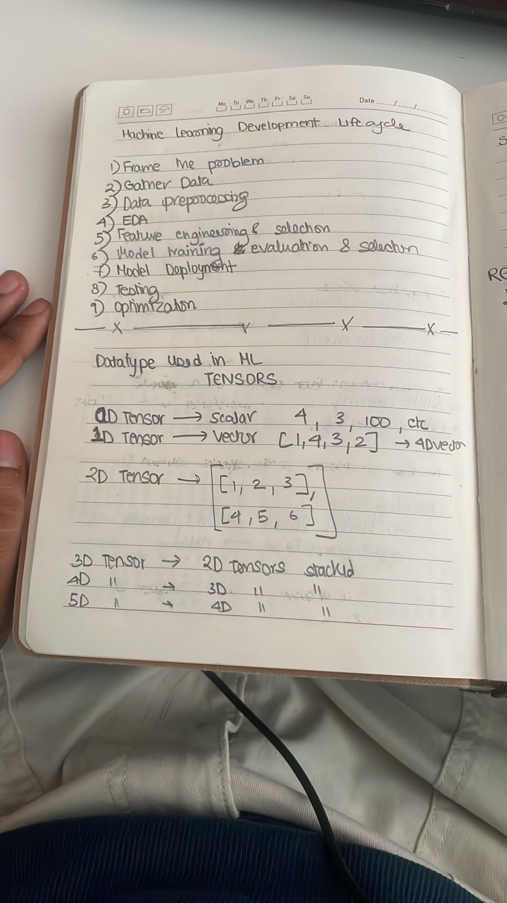
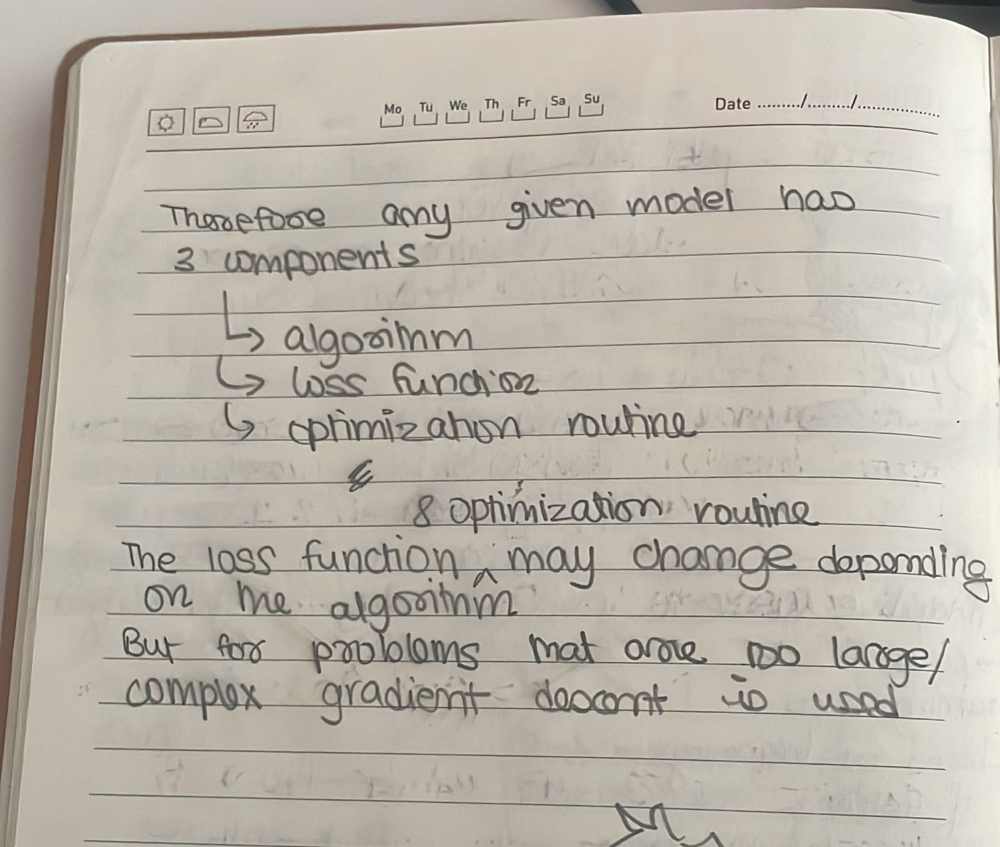
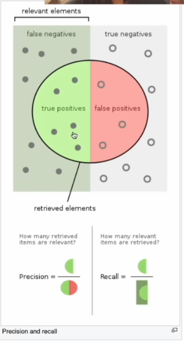

Date: 2025-12-05
Topics: #ai 
Purpose:
Link: 
Class: [[AI]]

---

# Machine Learning

Using computers to find a pattern between data and output. 

## Types of machine learning

### [Supervised Learning](Supervised%20Learning.md)

### [Unsupervised Learning](Unsupervised%20Learning.md)

### [[Reinforcement Learning]]

## Training data split

To test each model we split the data in 3 parts
1. training: reduce the loss 
2. validation: compare the loss between different models
3. testing: checking the final time to see general adaptability, final reported performance

the split can be 60/20/20 or 80/10/10 

## ML Training Process

## Loss function

**Loss** is a measure of how accurate the model is or how close the predicted value of the model is to the output

A few examples of different loss functions are 
- **L1**: Mean Absolute Error **(MAE)** 
- **L2**: Mean Squared Error **(MSE)**
- **Binary Cross Entropy Loss**: Used for binary classifications

## Precision and Recall

**Precision** = true positives / total positive predictions
**Recall** = true positives / actual positive elements

