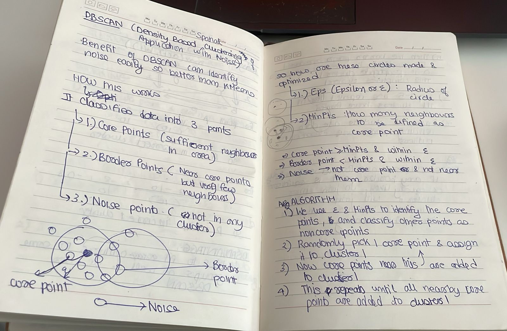
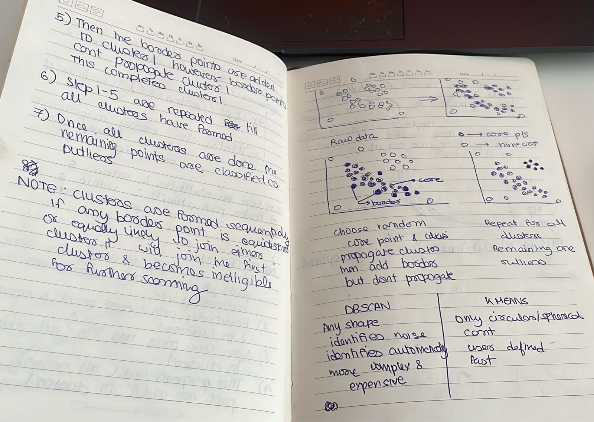
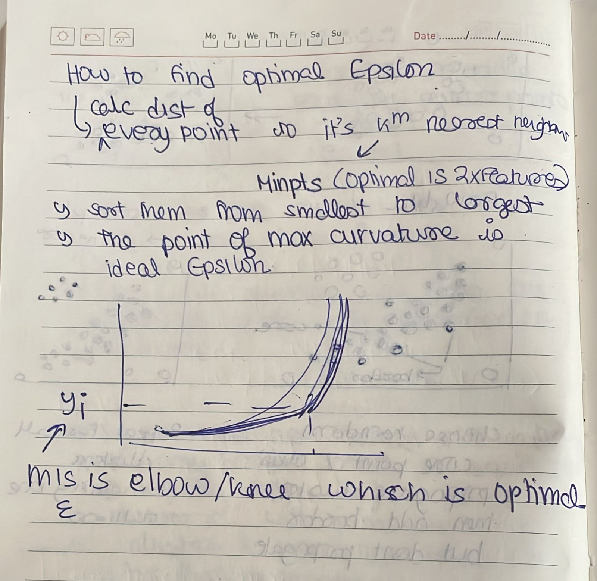

Date: 2026-05-15
Topics: #unsupervised_ml  #clustering #algorithm 
Purpose:
Link: 
Class: [[]]

---

## DBSCAN

DBSCAN (Density-Based Spatial Clustering of Applications with Noise) is a density-based clustering algorithm that groups together points that are closely packed and labels points in low-density regions as noise. It relies on two parameters:

- **epsilon (eps):** the radius used to search for neighbouring points.
- **minPts:** the minimum number of points required to form a dense region.

Points are classified as core (at least `minPts` within `eps`), border (fewer neighbours but within `eps` of a core), or noise (neither). DBSCAN discovers arbitrarily shaped clusters and is robust to outliers, but can struggle with clusters of varying densities or high-dimensional data. 

