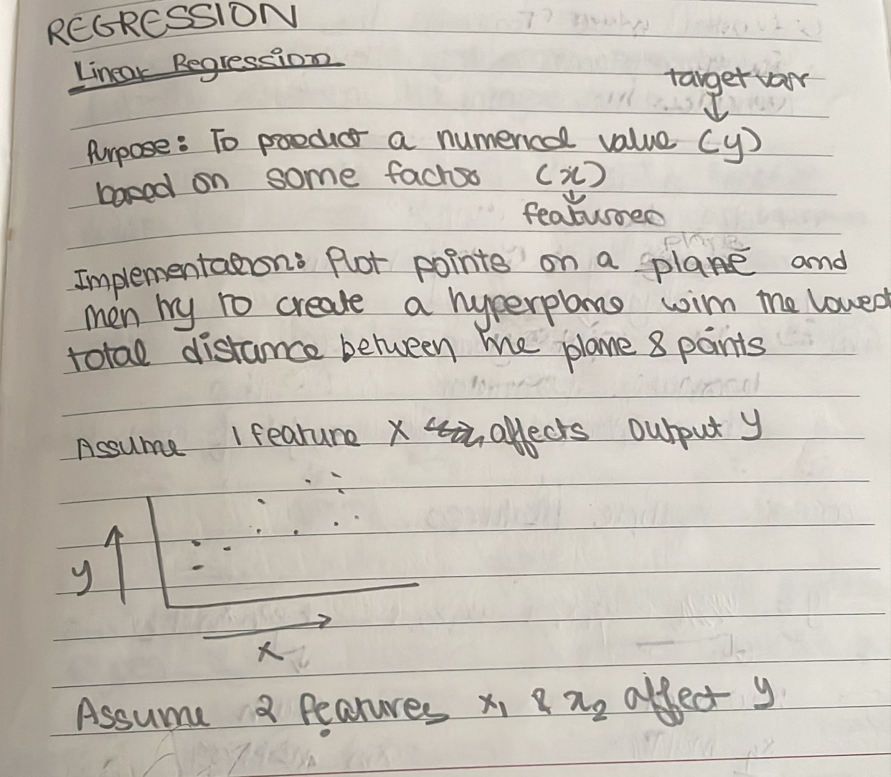
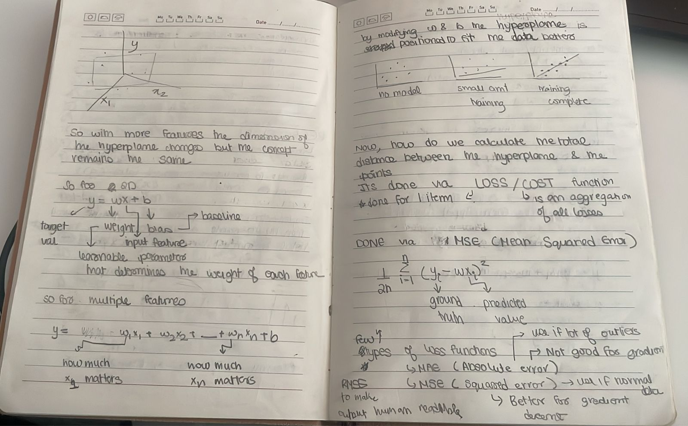

---
Linear Regression as the name suggests is a regression algorithm where the goal of the model is to find such a function which maps the closest to the data points. This function is represented as a line for data points with only 1 features and turns into a plane for 2 and so on as the dimensions change.

This is done in the assumption that if the function is able to map the closest to the current data points in the future where we will get similar data points it will be able to classify well. 

### Advantages vs Disadvantages

|Advantages|Disadvantages|
|---|---|
|Linear Regression is simple to implement and easier to interpret the output coefficients.|On the other hand in linear regression technique outliers can have huge effects on the regression and boundaries are linear in this technique.|
|When you know the relationship between the independent and dependent variable have a linear relationship, this algorithm is the best to use because of it’s less complexity compared to other algorithms.|Diversely, linear regression assumes a linear relationship between dependent and independent variables. That means it assumes that there is a straight-line relationship between them. It assumes independence between attributes.|
|Linear Regression is susceptible to over-fitting but it can be avoided using some dimensionality reduction techniques, regularization (L1 and L2) techniques and cross-validation.|But then linear regression also looks at a relationship between the mean of the dependent variables and the independent variables. Just as the mean is not a complete description of a single variable, linear regression is not a complete description of relationships among variables.|

### Types of Linear Regression

- **Simple Linear Regression:** Uses a single independent variable (\(x\)) to predict a dependent variable (\(y\)) using a straight line: \(y = \beta_0 + \beta_1x + \epsilon\).
- **Multiple Linear Regression (MLR):** Uses multiple predictors (\(x_1, x_2, \dots, x_k\)) to predict a continuous outcome: \(y = \beta_0 + \beta_1x_1 + \dots + \beta_kx_k + \epsilon\).
- **Polynomial Regression:** Models non-linear relationships by raising the independent variable to a power (e.g., \(x^{2}\), \(x^{3}\)) but remains linear in its coefficients.
- **Stepwise Regression:** An automated method for selecting the most significant independent variables in an MLR model.
- **Ridge/Lasso Regression:** Linear techniques that introduce [regularisation](../regularisation.md) to prevent overfitting in multiple regression.

It uses the loss function of 
1. [MSE](../Loss_Functions/MSE.md)
2. [MAE](../Loss_Functions/MAE.md)
