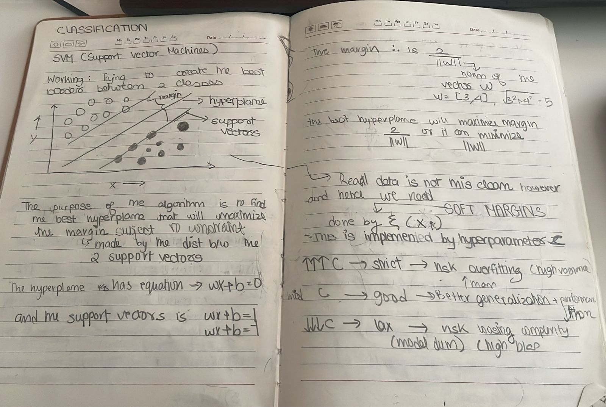

---

The center line (**hyperplane**) is used to divide the data into different clusters / classes. However there is some gap between the line and the data points closes to it that space is called margin

The goal here is to find the **optimal hyperplane** which will maximize the margin distance
The closest data points are used to create the margin borders, the data points are called as **support vectors**

Disadvantages
- Not very robust with outliers

we are allowed to manipulate the axes to create a sort of projection when its hard to classify data using svms on default, this is known as the **Kernel Trick** since we applied a **kernel** here

a kernel is any mathematical function which can map the data to a higher dimensional space

