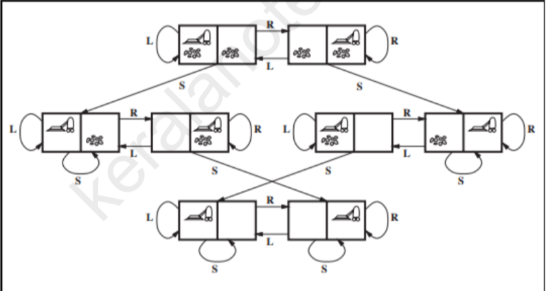

Date: 2025-11-10
Topics: #ai #clg_notes 
Purpose:
Link: 
Class: [[AI]]

---

# Module 2: AI and Machine Learning

Deeper dive into machine learning algorithms and techniques.

## Key topics

- Machine Learning overview
- Types of learning ([Supervised Learning](../../AI-ML/Supervised%20Learning.md), unsupervised, reinforcement)
- Common algorithms
- Evaluation metrics

## Learning objectives

- Understand different learning paradigms
- Know when to use which algorithm
- Learn how to evaluate models
- Understand loss functions and optimization

## Related notes

- [Module 1 AI](Module%201%20AI.md) - Foundation
- [AI-ML Basics](../../AI-ML/AI-ML%20Basics.md) - Core concepts
- [Supervised Learning](../../AI-ML/Supervised%20Learning.md) - Main approach
- [KNN](../../AI-ML/Algorithms/KNN.md), [Logistic Regression](../../AI-ML/Algorithms/Logistic%20Regression.md), [Naive Bayes](../../AI-ML/Algorithms/Naive%20Bayes.md), [Support Vector Machines (SVM)](../../AI-ML/Algorithms/Support%20Vector%20Machines%20(SVM).md)

---

## Problem solving Agents  

**Problem Solving** are a type of goal-based agents that uses an [atomic representation](Module%201%20AI.md#Representation)
Goal-based agents that use [factored](Module%201%20AI.md#Representation) or [structured](Module%201%20AI.md#Representation) are called **planning agents**

### Components for Problem Solving
To solve any problem we need to perform the following steps
1. **Goal Formulation**: Goals are created to reduce the scope of available actions for the agent. Goals are formed based on the performance measures of the agent and the current state. We formulate goals by creating a state space which starts at initial state and moves through each state using actions finally ending at goal state
2. **Problem Formulation**: Problem formulation refers to how the agent selects actions with the objective of reaching the goal state

### Properties of the environment
For a problem to be solvable the environment needs to adhere to the following properties
- **Observable**: The state should be completely visible to the agent
- **Discrete**: For any given state there should be finite steps to choose from 
- **Known**: Agent should know which actions lead to what states
- **Deterministic**: Each unique action should lead to a single state

## Search

**Definition**: Search is the process of finding the order of the steps/actions required to reach the goal state

The input of any search function is the problem and the output is the action sequence

The output is then used to begin the **execute** phase

### Open Loop System

An open loop system executes a pre-planned action sequence while ignoring the precepts that come from the environment because its already aware of what is going to come, its called open loop because it breaks the default feedback loop between the environment and the agent.

## Well Defined Problem ❗

The components of a well defined problem are:
1. **Initial State**: state where the agent starts in (start state)
2. **List of actions**: These are a list of all the functions/tools/actions that the agent can perform while solving the problem
3. **Transition Model**: Its a description for all actions and contains a function Result(S, A)  with parameters S which is current state and A which is Action this results the successor state 
	1. **Successor**: This is the output of the Result function
	2. **State Space**: Its a set of all states reachable by the initial state using any and all actions. It forms a directed graph/network.
	3. **Path**: Its the sequence of states traversed with a sequence of actions while attempting to solve the problem
4. **Goal State Test**: Its a check to see if the current state reached is a goal state or not
5. **Path Cost**: This is an optimization metric which calculates the total energy spent on a certain path to go from initial state to goal / final state. The path with least path cost is called **optimal solution**.

### The role of abstraction (formulation of problems)

**Abstraction**: Its the process of pruning irrelevant information and keeping only the most critical information in the problem description.
Its done to reduce the amount of information reaching the agent and not let it get overwhelmed in real world scenarios. Good abstractions are able to hide all the underline work required while ensuring validity and ease of understanding.

### Example problems with Toy and Real World Scenarios

#### Toy problems
- Vacuum
- 8 Queens
- 8 Puzzle

**Vacuum World**
This is state space and transition diagram for the vacuum world problem
Initial State: any of the following
Actions: Left , Right, Suck
Transition Model: Actions are self explanatory and only moving left when in left, moving right when in right and suck when area clean will result in no change
Goal Test: Checks if all area are clean 
Path cost: Number of steps taken to reach goal state depends on initial state and path taken

Similarly use the 5 components of a well defined problem to answer for 8 queens and 8 puzzle as well.

#### Real world Problems
- Route Finding 
- Travelling Salesman
- VLSI Design

**Route Finding**
This problem refers to how the user needs to reach to a specific location (goal state) by a specific time using different states (intermediate locations) 

For an airplane travel problem

**Initial State**: The initial state and final state could be any location and the current time and the required time to reach respectively. It also contains other meta data about the trip like the cost of each flight, type of travel etc.
**Actions**: Take any flight, choose any seat class, while ensuring enough time is there to promptly reach the goal state or destination
**Transition Model**: It contains the Result function which takes the current state and time as parameters and returns the subsequent state.
**Goal Test**: Check if the current state and goal state are the same and check if the current time is before or equal to the required time of arrival
**Path cost**: Check the cost of flights, time spent, etc to determine the total cost of the travel

### Searching for a solution
Any search problem has 3 main components
- Search space
- Initial State
- Goal test

### Metrics to measure performance of a solution
- **Completeness:** if a solution exists it should return it
- **Time complexity:** amount of time taken for the algorithm to complete execution
- **Space Complexity:** amount of space taken for the algorithm to complete execution
- **Optimality:** How does the algorithm compare with other solution if the path cost or the time complexity is the lowest then its the optimal solution

## Types of search algorithm

## Uninformed Search
There is no information about the search space except for how to traverse it and how to identify leaf and goal nodes.

It operates in a brute force method 

### BFS

It uses a stack queue structure to traverse the nodes, it checks level by level if the current node is the goal node

**Advantages**
- If there is a solution it will find it (**complete**)
- If there are multiple solutions it will find the optimal solution (**optimality**)

**Disadvantages**
- Its computationally more heavy since it needs more time and space(memory) to complete execution; Space complexity O(b^d); Time Complexity O(b^(d+1)) or O(b^d) for sufficiently huge value of d.
- Not optimal if the path cost is not constant between each state

**Algorithm**

create a queue and add the root node in it
until the queue is empty or the solution is found continue the execution of the following steps
	if the queue is empty return solution
	else if the queue is not empty
		Check if the current element is the final state if yes return current node as solution 
			else Pop the first element and add it to the visited array if its not there
			add the children of the popped node to the queue
			 repeat this procedure until the queue is empty

### Uniform Cost Search
Its a search algorithm for weighted graphs or trees where the path cost is not uniform, If the path cost is uniform its equivalent to a bfs.

It uses a **priority queue** as the data structure and is expands nodes based on the least path cost

**Advantages**
- **Optimality**: If there is an optimal solution the algorithm will find it

**Disadvantages**
- It can get stuck in infinite loops
- The time and space complexity are not ideal both are **O(b^[1+C/e])** here b is branching factor; C is the cost of optimal solution and e is the minimum step cost. Here is the link to a simple explanation of how the complexity is derived [here](https://stackoverflow.com/questions/19204682/time-complexity-of-uniform-cost-search)

### DFS
To solve issues with bfs and uniform cost search depth first search is used it uses a stack data structure, the algorithm is similar to bfs

**Advantages**
- The time and space complexity of this search algorithm are significantly less than bfs; Space: **O(bd)**; Time **O(b^d)** where b is branching factor and d is depth; 

**Disadvantages**
- The solution is not complete that is it may or may not find a solution even if the solution does exist 
- It may get trapped in an infinite loop
- The solution provided may or may not be optimal

### Depth Limited Search

Depth limited search puts a hard limit on the search space for a dfs algorithm, this prevents it from getting stuck in infinite loops 

The failure in this algorithm can happen in 2 ways
- **standard failure:** the item is not present or couldnt be found
- **cutoff failure:** the item is not inside the depth limit we set

**Advantages**
- memory efficiency

**Disadvantages**
- incomplete
- may not find the optimal solution

The time and space complexity remain the same instead of depth we use l which is the depth limit we set so Time: **O(b^l)** and Space: **O(bl)**

### Iterative deepening DFS

Its a combination of bfs and dfs, it places a limit and if the goal state isnt found inside the limit it increases it gradually

**Advantages**
- Uses the space complexity of dfs with the other benefits of bfs like completeness and optimality and time complexity

**Disadvantages**
- Repeats the work increasing the time complexity this is a tradeoff we have to accept to get reduced space complexity

### Summary of uninformed search

| Strategy                             | Data Structure Used                              | Mechanism (How it Works)                                                                          | Time Complexity                          | Space Complexity                         |
| :----------------------------------- | :----------------------------------------------- | :------------------------------------------------------------------------------------------------ | :--------------------------------------- | :--------------------------------------- |
| **Breadth-First Search (BFS)**       | **Queue**                                        | Expands the **shallowest** node first, systematically exploring layer by layer.                   | $O(b^{d})$                               | $O(b^{d})$                               |
| **Uniform-Cost Search (UCS)**        | **Priority Queue** (ordered by path cost $g(n)$) | Expands the node with the **lowest cumulative path cost** $g(n)$, guaranteeing cost optimality.   | $O(b^{1+\lfloor C^{*}/\epsilon\rfloor})$ | $O(b^{1+\lfloor C^{*}/\epsilon\rfloor})$ |
| **Depth-First Search (DFS)**         | **Stack**                                        | Expands the **deepest** node first, plunging quickly down one path until hitting a dead end.      | $O(b^{m})$                               | $O(bm)$                                  |
| **Depth-Limited Search (DLS)**       | **Stack**                                        | Functions like DFS but stops expanding when a predetermined **depth limit ($l$)** is reached.     | $O(b^{l})$                               | $O(bl)$                                  |
| **Iterative Deepening Search (IDS)** | **Stack** (repeatedly)                           | Repeatedly calls DLS, increasing the depth limit by one each iteration. Combines best of BFS/DFS. | $O(b^{d})$                               | $O(bd)$                                  |

## Informed Search

### Summary of Informed Search 

| Strategy                      | Data Structure Used                                  | Mechanism (How it Works)                                                                                                                      | Time Complexity (General) | Space Complexity (General) |
| :---------------------------- | :--------------------------------------------------- | :-------------------------------------------------------------------------------------------------------------------------------------------- | :------------------------ | :------------------------- |
| **Greedy Best-First Search!** | **Priority Queue** (ordered by $f(n) = h(n)$)        | Expands the node that is **closest to the goal** (lowest $h(n)$), ignoring cost incurred so far. Often fast, but **not Optimal** or Complete. | $O(b^m)$ or $O(b^d)$      | $O(b^m)$ or $O(b^d)$       |
| **A\* Search!**               | **Priority Queue** (ordered by $f(n) = g(n) + h(n)$) | Expands the node that minimizes the **total estimated path cost**. It is **Optimal** and **Complete** if $h(n)$ is **admissible**.            | $O(b^{*d})$ or $O(b^{d})$ | $O(b^{*d})$ or $O(b^{d})$  |
