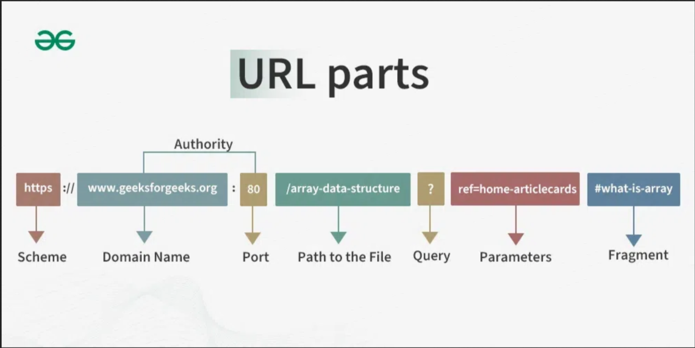
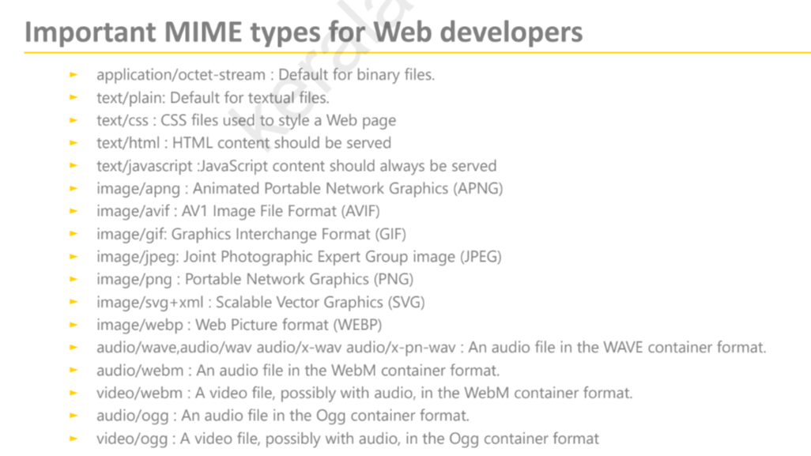

---

# Module 1: Web Programming Fundamentals

Basics of web development and HTML.

## Key topics

- Introduction to web development
- HTML basics (structure and elements)
- How websites work (client-server model)
- Web standards and best practices

## Learning objectives

- Understand what HTML is and how it works
- Learn basic HTML tags and structure
- Know how browsers interpret HTML
- Understand the basics of web pages

## Related topics

- Web development fundamentals
- Frontend technologies
- HTML, CSS, JavaScript basics 

---

## Web Basic

- **WWW**: world wide web, its an interconnected graph of hypertext documents 
- **Html**: hypertext markup language, its the language used to create all documents and webpages on the internet

**Hyperlinks**: clickable element that points to another resource like webpage, document, etc
They can also be used to reference mail ids of people using "mailto:"

### URL, URI, URN

| URL                                                                                                                 | URI                                                                                                     | URN                                                     |
| ------------------------------------------------------------------------------------------------------------------- | ------------------------------------------------------------------------------------------------------- | ------------------------------------------------------- |
| Full form: Uniform Resource locator                                                                                 | Full form: Uniform Resource Identifiers                                                                 | Full form: Uniform Resource Name                        |
| Specific type of URI that not only locates data but also provides the location and method of accessing the resource | They are a general term for whatever identifies any resource on the internet via name, location or both | Specific type of URI that identifies a resource by name |
| Ex: https://example.com                                                                                             | Ex: https://example.com , urn:isbn:031000                                                               | Ex: urn:isbn:031000                                     |

#### Structure of URL



1. **Scheme**: States the protocol used to access the resource
2. **Domain Name**: Name of the resource to be accessed
3. **Port Name**: Default port for accessing internet is port 80, this and domain name combined create authority
4. **Path**: path to the resource stored on the server
5. **Query**: Majorly found in dynamic webpage followed by parameters, its main purpose is to send extra parameters to the server to unlock extra functionality like sorting/filtering content and sending data to server
6. **Parameters**: Extra information sent to unlock functionality
7. **Fragments**: Internal page references that refer to a specific section inside the document appear after the # symbol

### Sending and Receiving data from the server

1. Send request to server, GET location of file HTTP version
2. Browser creates an HTTP request message with the optional and required headers
3. Server receives this message and then finds if the requested resource is available 
4. Then it relays the response using status codes
5. If the code is successful the the data is received and displayed on the browser

**Status codes**
- 1xx (information): request received, continuing process
- 2xx (success): 200 OK, most commonly seen by users
- 3xx (redirection): 301 location moved permanently
- 4xx (client error): 404 the resource requested could not be found
- 5xx (server error): 500 Internal server error, the server couldn't fulfill an apparently valid request due to some internal error


### MIME (Multipurpose Internet mail extention)

It describes the type of data format of the content that the server is transmitting to the browser this improves 
- security (exec files are not misinterpreted as harmless file types like image / text)
- display
- correctness

mime labels the file with the **type: image, text, video, application** and the **subtype: png, html, mp4, json**




### Http Headers 

During transmission the server first sends all of the headers then a blank line to indicate end of headers and start of content and then the content which is then displayed by the browser

#### Internal Linking

Linking to different pages or sections within the website

```html
<a href="about.html">About Us</a>
```
#### External Linking 

Linking to different webpages or websites

```html
<a href="https://www.example.com"> Example </a>
```


## HTML CODE

### TABLES

```html
<!DOCTYPE html>
<html lang="en">
	<head>
	  <meta charset="UTF-8" />
		<title>Browser</title>
	</head>
	<body>
	<table border="1">
		<tr>
			<th rowspan="2">Name</th>
			<th colspan="2">Marks</th>
			<th rowspan="2">Grade</th>
		</tr>
		<tr>
			<th>Math</th>
			<th>Science</th>
		</tr>
		<tr>
			<td>John</td>
			<td>85</td>
			<td>90</td>
			<td>A</td>
		</tr>
		<tr>
			<td>Jane</td>
			<td>88</td>
			<td>92</td>
			<td>A</td>
		</tr>
	</table>
	</body>
</html>
```


### Audio and Video

```html
<audio controls autoplay>
    <source src="filename.mp3" type="audio/mpeg">
    Your browser does not support the audio element.
</audio>
```

```html
<video controls autoplay width="640" height="360">
    <source src="filename.mp4" type="video/mp4">
    Your browser does not support the video tag.
</video>
```
### Images

```html

```

the image tag has multiple attributes that we can add like above which adds more functionality to the image the 4 basic ones are
- src
- height
- width
- alt

### Special Characters

no space required between & and text


### Lists

```html
<ul>
	<li>Item 1</li>
	<li>Item 2</li>
	<li>Item 3</li>
	<ol>
		<li>item 3.1</li>
		<li>item 3.2</li>
		<li>item 3.3</li>
	</ol>
</ul>
```

### Forms
```html
<!DOCTYPE html>
<html lang="en">
	<head>
	    <meta charset="UTF-8">
	    <meta name="viewport" content="width=device-width, initial-scale=1.0">
	    <title>Simple Registration Form</title>
	</head>
	<body>
	
	<form action="process.php" method="post">
	    <h1>User Registration</h1>
	
	    <label for="name">Full Name (Text Input):</label>
	    <input type="text" id="name" name="user_name" placeholder="John Doe" required><br><br>
	
	    <label for="email">Email Address (Email Type):</label>
	    <input type="email" id="email" name="user_email" required><br><br>
	
	    <label for="pass">Password (Password Type):</label>
	    <input type="password" id="pass" name="user_pass" required><br><br>
	
	    <label for="age">Age (Number Type):</label>
	    <input type="number" id="age" name="user_age" min="18" max="99" value="25"><br><br>
	
	    <label for="date">Start Date (Date Type):</label>
	    <input type="date" id="date" name="start_date"><br><br>
	
	    <label for="file">Upload Photo (File Type):</label>
	    <input type="file" id="file" name="user_photo"><br><br>
	
	    <h2>Select Gender (Radio Buttons - Mutually Exclusive)</h2>
	    <input type="radio" id="male" name="gender" value="male">
	    <label for="male">Male</label><br>
	    <input type="radio" id="female" name="gender" value="female" checked>
	    <label for="female">Female</label><br><br>
	
	    <h2>Interests (Checkboxes - Multiple Choice)</h2>
	    <input type="checkbox" id="coding" name="interests[]" value="coding">
	    <label for="coding">Coding</label><br>
	    <input type="checkbox" id="sports" name="interests[]" value="sports">
	    <label for="sports">Sports</label><br><br>
	
	    <label for="country">Country (Dropdown/Select):</label>
	    <select id="country" name="user_country" required>
	        <option value="">-- Please Select --</option>
	        <option value="usa">USA</option>
	        <option value="can" selected>Canada</option>
	        <option value="mex">Mexico</option>
	    </select><br><br>
	
	    <label for="bio">Short Bio (Textarea):</label><br>
	    <textarea id="bio" name="user_bio" rows="4" cols="50"></textarea><br><br>
	
	    <!-- The Submit Button: Sends data to the action URL -->
	    <input type="submit" value="Register Now">
	    <input type="reset" value="Clear Form">
	
	</form>
	
	</body>
</html>
```

other important attributes
- autocomplete 


### Page Structure Elements

- header
- title
- nav
- figure
	- figcaption
- article
- section
- summary
- footer

### diff between id and name attr

| Feature           | `id`                            | `name`                             |
| ----------------- | ------------------------------- | ---------------------------------- |
| Unique?           | Yes                             | No                                 |
| CSS Selector?     | Yes (`#id`)                     | No                                 |
| JavaScript DOM?   | Yes (`document.getElementById`) | Not directly (unless form-related) |
| Form Submission?  | No                              | Yes                                |
| Used in `<label>` | Yes (`for="id"`)                | No                                 |
