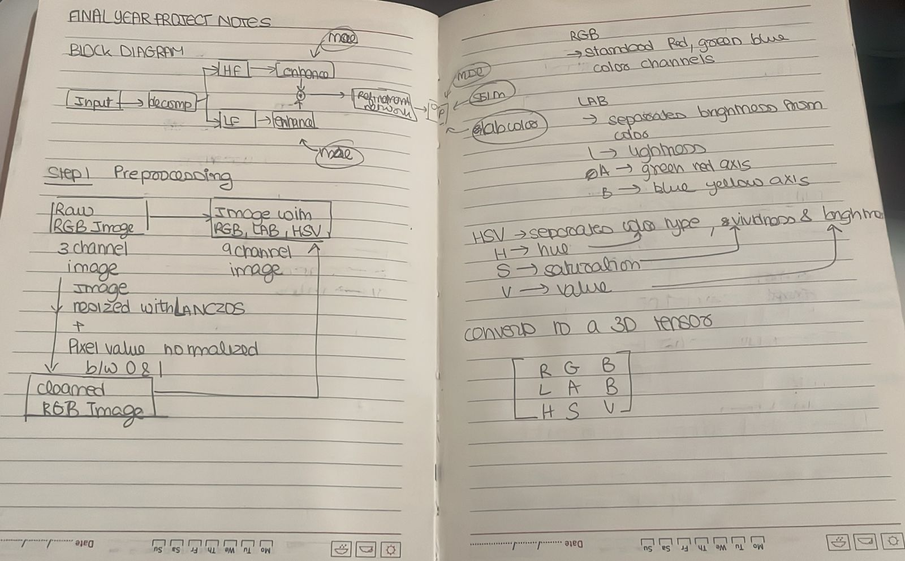
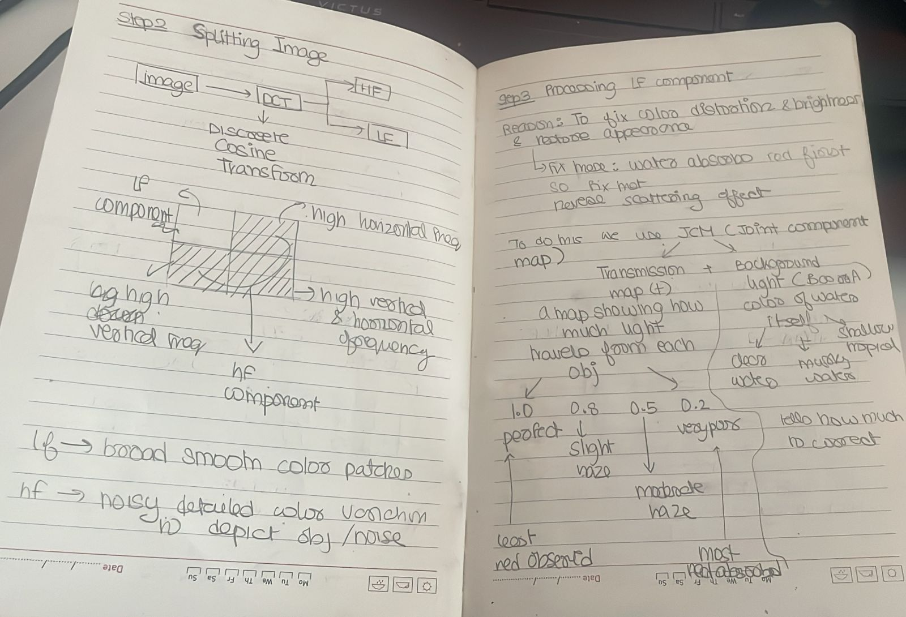
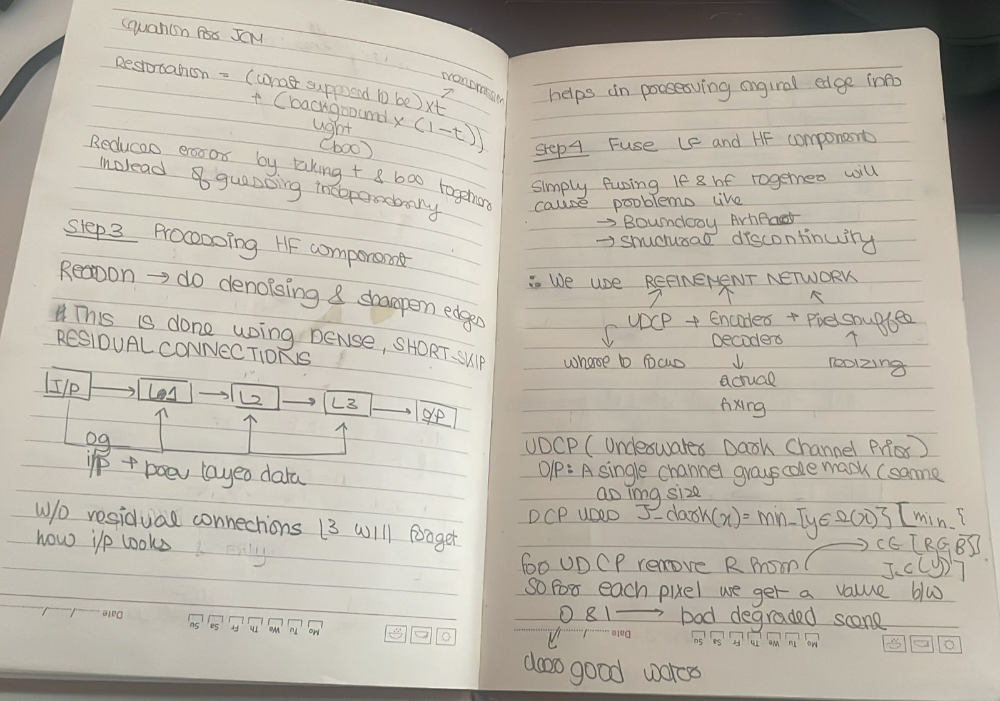
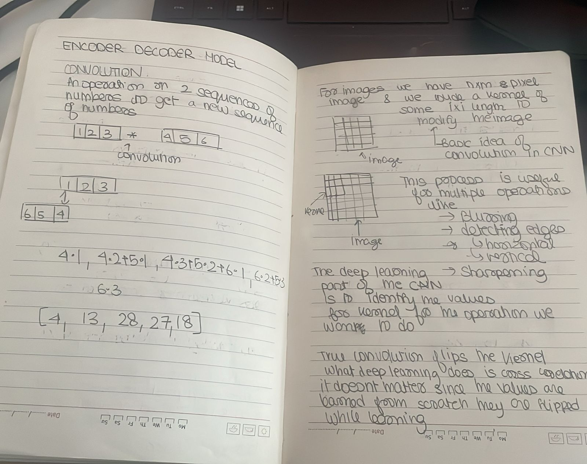
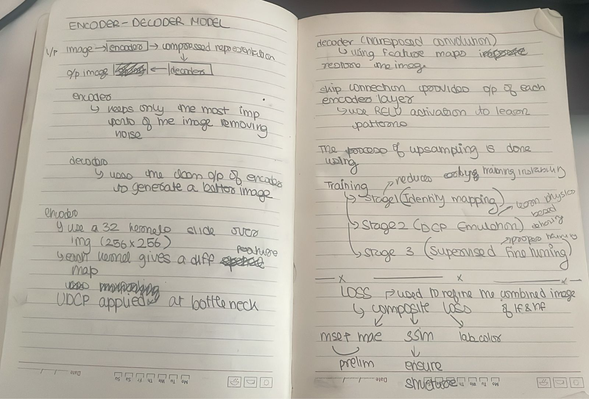

Scope: Full project knowledge transfer with emphasis on `Deep Learning/` and the final report material in `Docs/`.

---

## 1) Project Data Flow in Simple Terms (Start Here)

Think of the system as a 4-step pipeline:

1. Input image is loaded and standardized.
- The image is resized, normalized, and converted into richer color representations.

2. Image is split into two parts.
- Part A: low-frequency content (smooth color, brightness, haze).
- Part B: high-frequency content (edges, texture, details).

3. The two parts are enhanced separately.
- One network branch improves low-frequency defects.
- Another branch improves high-frequency defects.

4. Both branches are merged and refined one more time.
- The merged output is passed through a refinement network.
- A degradation-guided attention map highlights difficult underwater regions.
- Final enhanced RGB image is produced.

Simple analogy:
- First, one specialist fixes "color and lighting".
- Second, another specialist fixes "sharpness and details".
- Third, a final specialist combines both results and does quality control.

Primary implementation files:
- `Deep Learning/preprocessing.py`
- `Deep Learning/dct.py`
- `Deep Learning/model.py`
- `Deep Learning/utilities.py`

---

## 2) Implementation Details: How This Flow Is Achieved

This section explains the technical pieces that make the pipeline possible.

### 2.1 Input preprocessing and data packaging

Implemented in `Deep Learning/preprocessing.py`.

What happens:
- Image is loaded as RGB.
- Image is resized using Lanczos interpolation.
- Pixel values are normalized to [0, 1].
- Image is transformed into multiple color spaces.
- DCT-based splitting creates LF and HF images.
- Data is packed into tensors for model input.

#### What is Lanczos interpolation?
Beginner explanation:
- When resizing, the model needs clean pixels. Lanczos is a high-quality resizing method that preserves details better than nearest-neighbor and often better than bilinear.

Formal definition:
- Lanczos uses a windowed sinc kernel:
$$
L(x)=\begin{cases}
\mathrm{sinc}(x)\,\mathrm{sinc}(x/a), & |x|<a\\
0, & \text{otherwise}
\end{cases}
$$
where $a$ is the window size (commonly 2 or 3).

#### What is RGB, LAB, HSV packing and why used?
The model does not only use RGB. It packs 9 channels:
- RGB (3 channels)
- LAB (3 channels)
- HSV (3 channels)

So each LF/HF tensor has 9 channels.

Beginner explanation:
- RGB tells "how much red/green/blue".
- LAB separates brightness from color in a way that better matches human perception.
- HSV separates color type (hue), vividness (saturation), and brightness (value).
- Using all three helps the model learn underwater color correction more robustly.

Formal definitions:
- LAB:
  - L*: lightness
  - a*: green-red axis
  - b*: blue-yellow axis
  - Derived from CIE XYZ after nonlinear transform, designed to be perceptually more uniform than RGB.
- HSV:
  - H: hue angle
  - S: saturation
  - V: value (brightness)
  - In this project, H is normalized by 180, S and V by 255 (OpenCV convention).

### 2.2 Frequency decomposition using DCT

Implemented in `Deep Learning/dct.py` and also mirrored in `split_image_dct` inside `Deep Learning/preprocessing.py`.

Beginner explanation:
- DCT converts an image into frequency space.
- Top-left DCT coefficients represent smooth/global information.
- Remaining coefficients represent local/detail information.
- Project keeps a square low-frequency block using cutoff ratio (`DCT_CUTOFF_RATIO = 0.2`) and uses the rest as high-frequency.

Formal definition (2D DCT-II):
$$
C(u,v)=\alpha(u)\alpha(v)\sum_{x=0}^{N-1}\sum_{y=0}^{M-1}f(x,y)
\cos\left(\frac{\pi(2x+1)u}{2N}\right)
\cos\left(\frac{\pi(2y+1)v}{2M}\right)
$$

### 2.3 Network architecture and components

Implemented in `Deep Learning/model.py`.

Main components:
- `LFEnhancementNetwork`
- `HFEnhancementNetwork`
- `PreliminaryEnhancementNetwork`
- `RefinementNetwork`
- `ImageEnhancementNetwork` (full pipeline wrapper)

Data flow inside model:
1. Input tensors: `lf` and `hf`, each shape `(B, 9, H, W)`.
2. LF and HF are enhanced in parallel.
3. Preliminary image is built by adding LF and HF branch outputs.
4. Refinement input is built by concatenating:
- preliminary image (3 channels)
- LF RGB channels (3)
- HF RGB channels (3)
5. Refinement network outputs final RGB image.

### 2.4 Attention mechanism used in this project

Implemented in `Deep Learning/utilities.py` and applied in `RefinementNetwork` in `Deep Learning/model.py`.

Important clarification:
- This codebase uses DCP-guided attention.
- SimAM is not implemented in this repository.

Beginner explanation:
- The model computes a map of likely degraded/hazy regions.
- Feature maps are multiplied by this attention map.
- So the model "looks harder" at problematic regions.

Formal definition (simplified):
- Dark channel prior:
$$
J_{dark}(x)=\min_{y\in\Omega(x)}\min_{c\in\{r,g,b\}}J^c(y)
$$
- Transmission estimate:
$$
t(x)=1-\omega\cdot J_{dark}(x)
$$
- Reverse transmission attention map (project form):
$$
A(x)=1-\lambda\,t(x)
$$
where scaling constants come from `Deep Learning/constants/__init__.py`.

### 2.5 Supporting technologies from literature (field context)

From `Docs/Latex/Final Report/chapters/Literature_review/` and `summary.tex`, key technology families in underwater enhancement are:
- Retinex + color correction methods
- Transmission/physics-based dehazing methods
- GAN-based enhancement
- Wavelet-based dual-stream networks
- Lightweight U-Net style models
- Non-reference evaluation frameworks/datasets

How this project is positioned:
- It combines classical prior guidance (DCP-like transmission cues) with deep dual-stream learning (LF/HF decomposition) and multi-color-space embedding.

---

## 3) Training Decisions, Curriculum Learning, and Loss Design

Implemented in `Deep Learning/train.py` and `Deep Learning/loss.py`.

### 3.1 Why curriculum learning was chosen

Beginner explanation:
- Training one complex objective from scratch is unstable.
- So the project starts with easy tasks, then medium tasks, then full supervised learning.
- This is curriculum learning: simple to hard.

### 3.2 Training phases used in this repository

Phase 1: Identity-style pretraining
- Parameters: `UnsupervisedPretrainingParameters` in `Deep Learning/constants/TrainingParameters.py`
- Objective: model learns stable base mapping (easy target).
- Why: warm-starts network and reduces early training instability.

Phase 2: Knowledge transfer from DCP enhancement
- Uses `enhanceDCP(...)` as teacher-like target in `train.py`.
- Objective: network first learns physically meaningful dehazing behavior.
- Why: injects classical prior knowledge before full supervised optimization.

Phase 3: Supervised training with full composite loss
- Parameters: `SupervisedTrainingParameters`.
- Objective: optimize against paired ground-truth targets.
- Why: maximize fidelity + perceptual quality + color/contrast consistency.

 

### 3.3 Loss functions used, when used, and why

`CompositeLoss` in `Deep Learning/loss.py` combines multiple losses.

1. MAE / L1 loss (refinement image)
- When: final output vs GT.
- Why: robust pixel-level reconstruction.
- Formula:
$$
L_1=\frac{1}{N}\sum_i |y_i-\hat y_i|
$$

2. Preliminary LF branch MSE
- When: LF branch output vs GT LF.
- Why: stabilizes LF branch for smooth/color components.
- Formula:
$$
L_{MSE}=\frac{1}{N}\sum_i (y_i-\hat y_i)^2
$$

3. Preliminary HF branch L1
- When: HF branch output vs GT HF.
- Why: detail reconstruction can benefit from edge-preserving L1 behavior.

4. SSIM loss
- When: final output vs GT.
- Why: preserves structural similarity and visual consistency.
- Formula:
$$
L_{SSIM}=1-SSIM(\hat y,y)
$$

5. Perceptual loss (MobileNet features)
- When: final output vs GT feature spaces.
- Why: encourages semantically realistic textures/colors.
- Formula:
$$
L_{perc}=\|\phi(\hat y)-\phi(y)\|_2^2
$$

6. LAB color loss
- When: downsampled output/GT in LAB space (`ab` channels).
- Why: improves chroma correctness for underwater color cast problems.

7. Local contrast loss
- When: downsampled output/GT grayscale local standard deviation maps.
- Why: prevents flat-looking images and restores local detail contrast.

Why these losses were selected together:
- No single loss can enforce all desired properties.
- Pixel losses give fidelity.
- SSIM gives structure.
- Perceptual gives realism.
- LAB/color and contrast losses target underwater-specific artifacts.
- Branch losses keep LF/HF specialists aligned with their roles.

### 3.4 Optimization strategy

From `train.py`:
- Optimizer: Adam
- Scheduler: `ReduceLROnPlateau`
- Mixed precision: enabled on CUDA (`torch.amp`)
- Early stopping: controlled by `EARLY_STOPPING`

Why:
- Adam is stable for multi-loss image restoration.
- Plateau scheduling helps when validation loss stalls.
- AMP reduces memory and speeds up training.

---

## 4) Metrics: What We Use, Why, and Practical Thresholds

Primary metrics are documented in `Docs/Latex/Report/results.tex` and used in evaluation scripts/notebooks.

### 4.1 Metrics used

1. SSIM (Structural Similarity Index)
- Purpose: compare structural consistency with ground-truth.
- Range: typically [0,1], higher is better.
- Formula:
$$
SSIM(x,y)=\frac{(2\mu_x\mu_y+C_1)(2\sigma_{xy}+C_2)}{(\mu_x^2+\mu_y^2+C_1)(\sigma_x^2+\sigma_y^2+C_2)}
$$

2. PSNR (Peak Signal-to-Noise Ratio)
- Purpose: measure pixel-level reconstruction quality versus GT.
- Unit: dB, higher is better.
- Formula:
$$
PSNR=10\log_{10}\left(\frac{MAX_I^2}{MSE}\right)
$$

3. UIQM (Underwater Image Quality Measure)
- Purpose: no-reference perceptual underwater quality (useful when GT quality and visual appeal diverge).
- Higher is better, but very high UIQM can sometimes correspond to over-enhancement.
- Common decomposition:
$$
UIQM=c_1\,UICM+c_2\,UISM+c_3\,UIConM
$$

4. Average inference time (ms)
- Purpose: deployment feasibility and speed-quality tradeoff.

### 4.2 Reported results from the final report

From `Docs/Latex/Report/results.tex`:
- Best_UW_Model: SSIM 0.712910, PSNR 16.943448, UIQM 7.374222, Time 180.591848 ms
- Shallow_UWnet: SSIM 0.698606, PSNR 15.482757, UIQM 7.413264, Time 97.488557 ms
- Wavelet_Based: SSIM 0.330268, PSNR 9.797363, UIQM 18.605637, Time 114.276461 ms

Beginner interpretation:
- Best_UW_Model is most faithful to GT (best SSIM/PSNR).
- Shallow_UWnet is fastest while still close on SSIM.
- Wavelet_Based has strongest UIQM, but weak SSIM/PSNR indicates lower GT fidelity.

### 4.3 Required threshold guidance (practical)

Important note:
- There is no universal hard threshold for underwater enhancement; acceptable values depend on dataset and application.

Project-oriented recommended acceptance bands (based on current report behavior):
- SSIM: target >= 0.68 for strong structure preservation on this pipeline.
- PSNR: target >= 15 dB as practical minimum for acceptable reconstruction.
- UIQM: target 6.5-9 for balanced enhancement without severe over-processing in this setup.
- Inference time:
  - real-time-ish UI use: <= 120 ms/image preferred
  - highest-quality offline mode: <= 200 ms/image acceptable

How to use thresholds correctly:
- Do not use UIQM alone to select the final model.
- Choose model by multi-objective rule:
  - if fidelity-critical: prioritize SSIM + PSNR,
  - if visual enhancement demo: include UIQM,
  - if deployment-critical: include latency budget.

---

## Minimal Backend/Frontend Context (only what is required)

Backend (`Backend/`):
- Receives uploaded image, runs model inference, returns enhanced output.
- Must stay synchronized with architecture and checkpoint format from `Deep Learning/model.py`.

Frontend (`Frontend/`):
- Upload image -> call backend -> show enhanced image to user.

---

## One-Page Beginner Recap

- Underwater image quality suffers from haze, color cast, low contrast.
- This project splits each image into smooth part (LF) and detail part (HF).
- It enhances both parts with dedicated branches.
- It merges them and refines using degradation-guided attention.
- Training is done in 3 phases (easy -> harder -> full supervised).
- Quality is measured by SSIM, PSNR, UIQM, and inference time.
- Best model choice depends on whether your priority is fidelity, speed, or perceptual enhancement.
